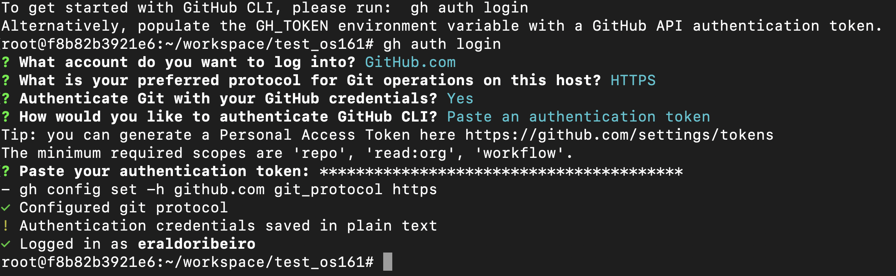
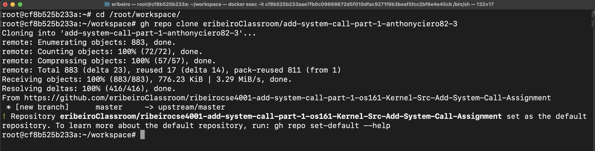
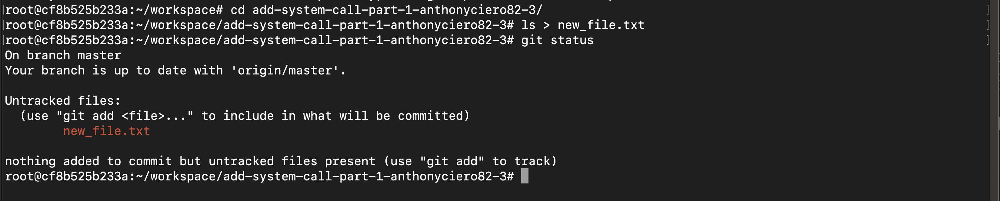
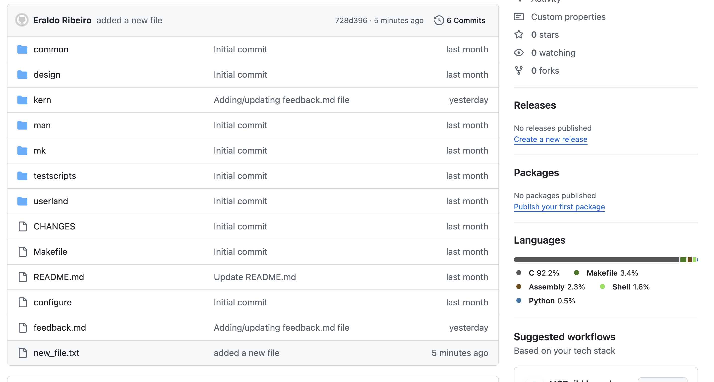

# Notes on using GitHub for submitting assignments for CSE4001


## Install the GitHub Command Line Interface (CLI)

The GitHub CLI installation will be done on the Linux in the CSE4001 Docker container. The goal is to run most assignment-related commands and steps from inside the CSE4001 docker container. 

To install the GitHUb CLI, I tried to use the package manager (e.g.,  `brew`) instructions provided by the GitHub page but the instructions did not work for me because the package manager couldn’t find the package `gh`. 

Instead, I installed `gh` by followed the instructions from the following page: 

[https://github.com/cli/cli/blob/trunk/docs/install_linux.md](https://github.com/cli/cli/blob/trunk/docs/install_linux.md). 

Specifically, I followed the instructions for `Debian, Ubuntu Linux, Raspberry Pi OS (apt)`. Here, we need to remove the `sudo` at the start of the instruction. We use `sudo` when we want to execute commands with admin rights. However, this is not needed for the `CSE4001`. So, the `sudo` keyword needs to be removed from the installation line before using it, i.e.: 

```bash
(type -p wget >/dev/null || (apt update && apt-get install wget -y)) &&  mkdir -p -m 755 /etc/apt/keyrings && wget -qO- https://cli.github.com/packages/githubcli-archive-keyring.gpg | tee /etc/apt/keyrings/githubcli-archive-keyring.gpg > /dev/null && chmod go+r /etc/apt/keyrings/githubcli-archive-keyring.gpg && echo "deb [arch=$(dpkg --print-architecture) signed-by=/etc/apt/keyrings/githubcli-archive-keyring.gpg] https://cli.github.com/packages stable main" | tee /etc/apt/sources.list.d/github-cli.list > /dev/null && apt update && apt install gh -y
```

When copying/pasting this line to your command line, make sure it is a single-line command (i.e., line breaks). The command's expected output is:

```bash
Hit:1 https://cli.github.com/packages stable InRelease
Hit:2 http://archive.ubuntu.com/ubuntu focal InRelease
Hit:3 http://security.ubuntu.com/ubuntu focal-security InRelease
Hit:4 http://archive.ubuntu.com/ubuntu focal-updates InRelease
Hit:5 http://archive.ubuntu.com/ubuntu focal-backports InRelease
Reading package lists... Done
Building dependency tree       
Reading state information... Done
All packages are up to date.
Reading package lists... Done
Building dependency tree       
Reading state information... Done
The following packages were automatically installed and are no longer required:
  docutils-common javascript-common libimagequant0 libjs-jquery libjs-sphinxdoc libjs-underscore libwebpdemux2 python-babel-localedata
  python3-alabaster python3-babel python3-click python3-colorama python3-docopt python3-docutils python3-feedparser python3-imagesize
  python3-jinja2 python3-markupsafe python3-numpydoc python3-olefile python3-packaging python3-pil python3-ply python3-prompt-toolkit
  python3-pygments python3-pyparsing python3-roman python3-setproctitle python3-sigmavirus24-urltemplate python3-sphinx python3-tz
  python3-venv python3-wcwidth python3.8-venv sgml-base sphinx-common xml-core xonsh
Use 'apt autoremove' to remove them.
The following NEW packages will be installed:
  gh
0 upgraded, 1 newly installed, 0 to remove and 0 not upgraded.
Need to get 13.7 MB of archives.
After this operation, 50.3 MB of additional disk space will be used.
Get:1 https://cli.github.com/packages stable/main amd64 gh amd64 2.57.0 [13.7 MB]
Fetched 13.7 MB in 1s (9284 kB/s)
debconf: delaying package configuration, since apt-utils is not installed
(Reading database ... 52699 files and directories currently installed.)
Preparing to unpack .../archives/gh_2.57.0_amd64.deb ...
Unpacking gh (2.57.0) ...
Setting up gh (2.57.0) ...
root@f8b82b3921e6:~/workspace/test_os161#
```

## Authenticate using github credentials or access token
The next step is to use `gh` to set the authentication credentials and test to see if it is working properly. This step is described well in the following blog post by Michael England on using GitHub CLI `gh`: 

- https://micheal.dev/blog/ghcli-1-installing-and-authorizing-the-githubcli/

The blog suggests the use of `SSH` for authentication. While `SSH` should work just fine, I decided to use `HTTPS`, and pasted my GitHub Token when prompted. The GitHub token seems to encode my username information because the authentication process did not ask me for my username, and just logged me directly. See steps below:



Once `gh` authentication is done, we can clone repositories and perform other tasks such as `git add`, `git commit` and `git push`. 

## Sequence of steps for working on CSE4001 assignments

Assignments in CSE4001 will be submitted via GitHub Classroom. Once the assignment invitation is accepted, a private repository for the assignment is created using the student username. The repository will contain the description of the assignment and code or files that are needed to start the assignment. The main steps to work on assignments are: 

1. Accept the assignment invitation.
2. Open the URL of the assignment repository, and copy the `gh` cloning command (or the repository URL, if cloning using `git clone` instead of `gh repo clone`).
3. In the CSE4001 container, go to `/root/workspace/`, and from there clone the assignment repository. Do not `git fork` or `download` the repository. You must clone it. 
4. Edit the code, add files, and complete the assignment. Test the assignment to make sure it works as expected. 
5. As you work on the assignment, commit your changes often (e.g., once you take a break from working or every hour). The commits will save the history of changes locally. If something happens or breaks, and you cannot fix the issue, you can  reverse the changes to a previous point where things were working. 
6. You can check the status of the repository by running `git status`. 
7. Finally, once the assignment is completed, you will `commit` and `push` the changes to the assignment repository in the GitHub's server. 

In general, once the repository is cloned, there are only four git commands that you will use to submit your assignments. They are: 

- `git status`
- `git add .`
- `git commit -am "some message describing the changes made to the code."`
- `git push`

The `status` is a list of the changes that were made and describes the current state of the source control for the repository. The option `add .` adds new files to git. The `commit` action updates the state of the source control. Until this point, all changes are local and are not on the GitHub server. As a result, these steps are not sufficient for submission. The final step, i.e., `push` transfers all the local changes to the remote server. Only after `push`, the submission is completed. 

In the next example, I will add a new file to the repository, check the status of the repository, commit the changes locally, and finally submit the changes to the server. 

## Example

### Clone an assignment (repository)

Go to the URL of the repository you want to clone and copy one of the commands for cloning the repository. The command used in the following figure uses the GitHub CLI tool: 


Copy that command line and run it on the linux terminal of the docker container inside the `/root/workspace/`directory. See figure below:




### Add a new file and check status



Checking the status helps us see what changes need to go into source control. The message tells us to run `git add` to include the file into Git. 

### Commit and push

I will add, commit, and push, i.e.: 


Of course, we don't need to call `git status` every time we change something or do something. I did that here to show the different states of the source control after each step was completed. Also, git can save the authentication credentials to avoid entering them every time we push something to the server. But, this time my system asked for the username and password. The username is the same git username and the password I use is the personal GitHub Token that I simply paste on the password prompt (I keep it in a file on the computer).

To see the changes on the server, we can re-load the repository URL and the changes should be there, i.e.: 



See the last file on the list in the above figure. 

### (Re-)clone the new version and test it again to make sure it works

Some assignments will have automated test scripts (i.e., autograding) that will execute everytime changes are pushed to the repository. These tests help show that the submission seems to be correct. But, sometimes the automated tests are not available for the assignment. 

> Then, how do we know if the submission that has been `pushed` to the repository on the GitHub server works the same as the local copy? 

**Re-clone it and test on a temp directory**. One way that I think it works well for checking if the files on the GitHub works just like the local copy is to re-clone the repository into a temporary directory and run the program from there. 

Just seeing the changes does not guarantee that we submitted all files. We might have forgotten to add some files or something else might be missing. To check the submission, we can create a temporary directory inside your local `/root/workspace/` and, from that directory, (re-)clone the newly pushed repository, and then execute the program to make sure it is complete and runs as expected. If it does then at least we know that the program on the server works the same as the version on our personal computer. 

