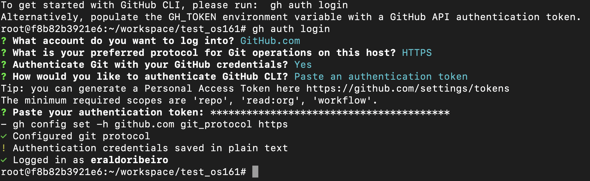
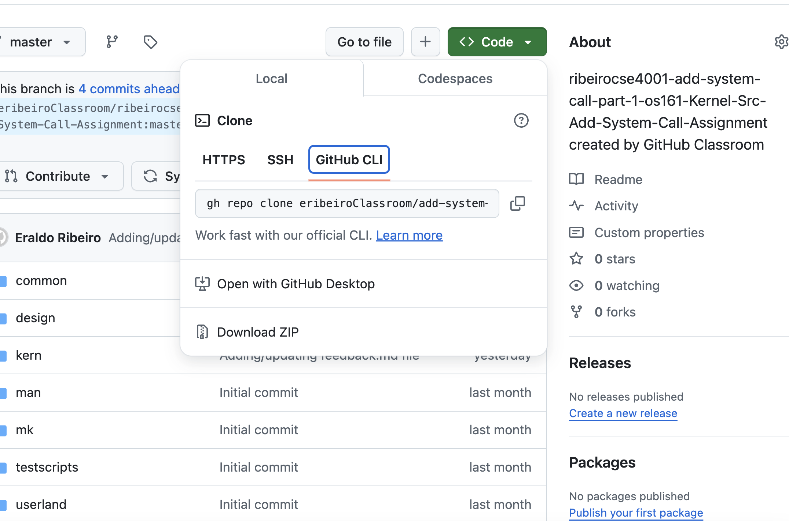
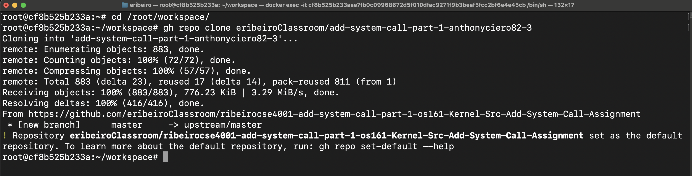
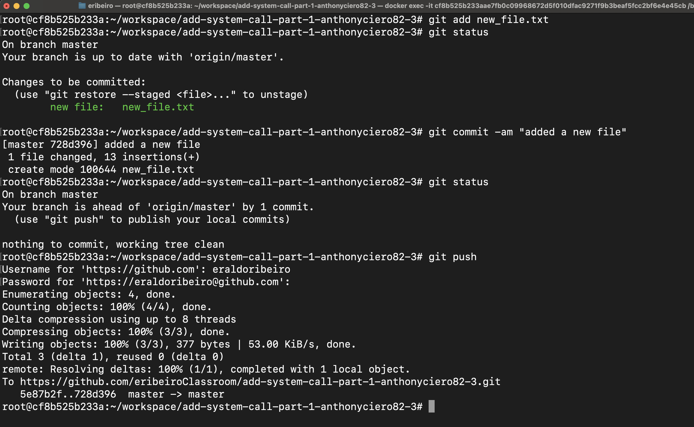
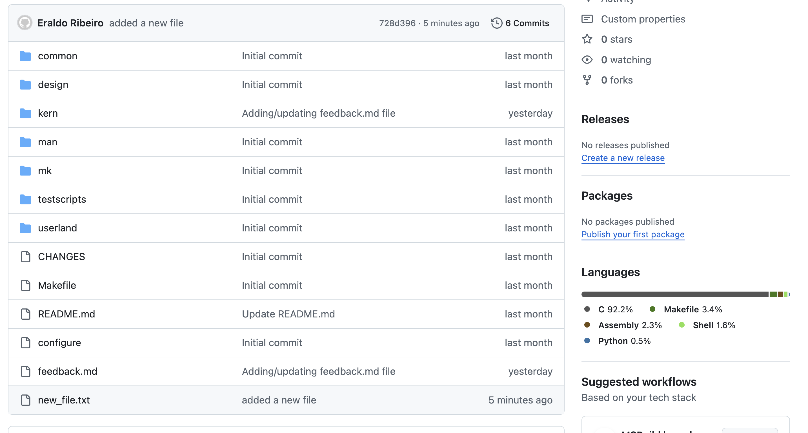

# Notes on using GitHub for submitting assignments


## Install the GitHub Command Line Interface (CLI)

The installation will be done on the Linux on the CSE4001 Docker container. I tried to use the package manager (e.g.,  `brew`) instructions provided by the github page but they did not work because, in my case, the package manager couldn’t find the package `gh` . To install `gh`, I followed the instructions from this page: [https://github.com/cli/cli/blob/trunk/docs/install_linux.md](https://github.com/cli/cli/blob/trunk/docs/install_linux.md). Specifically, I used the instructions for `Ubuntu Linux`. But the instructions use `sudo` to execute the installation commands with admin rights. Our `CSE4001` container does not need/use `sudo`. So, I removed the `sudo` keyword from the installation line before using it, i.e.: 

```bash
(type -p wget >/dev/null || (apt update && apt-get install wget -y)) &&  mkdir -p -m 755 /etc/apt/keyrings && wget -qO- https://cli.github.com/packages/githubcli-archive-keyring.gpg | tee /etc/apt/keyrings/githubcli-archive-keyring.gpg > /dev/null && chmod go+r /etc/apt/keyrings/githubcli-archive-keyring.gpg && echo "deb [arch=$(dpkg --print-architecture) signed-by=/etc/apt/keyrings/githubcli-archive-keyring.gpg] https://cli.github.com/packages stable main" | tee /etc/apt/sources.list.d/github-cli.list > /dev/null && apt update && apt install gh -y
```

When copying this line, make sure it is a single-line command instead of one with line breaks. The output I got once I executed the command is as follows: 

```bash
Hit:1 https://cli.github.com/packages stable InRelease
Hit:2 http://archive.ubuntu.com/ubuntu focal InRelease
Hit:3 http://security.ubuntu.com/ubuntu focal-security InRelease
Hit:4 http://archive.ubuntu.com/ubuntu focal-updates InRelease
Hit:5 http://archive.ubuntu.com/ubuntu focal-backports InRelease
Reading package lists... Done
Building dependency tree       
Reading state information... Done
All packages are up to date.
Reading package lists... Done
Building dependency tree       
Reading state information... Done
The following packages were automatically installed and are no longer required:
  docutils-common javascript-common libimagequant0 libjs-jquery libjs-sphinxdoc libjs-underscore libwebpdemux2 python-babel-localedata
  python3-alabaster python3-babel python3-click python3-colorama python3-docopt python3-docutils python3-feedparser python3-imagesize
  python3-jinja2 python3-markupsafe python3-numpydoc python3-olefile python3-packaging python3-pil python3-ply python3-prompt-toolkit
  python3-pygments python3-pyparsing python3-roman python3-setproctitle python3-sigmavirus24-urltemplate python3-sphinx python3-tz
  python3-venv python3-wcwidth python3.8-venv sgml-base sphinx-common xml-core xonsh
Use 'apt autoremove' to remove them.
The following NEW packages will be installed:
  gh
0 upgraded, 1 newly installed, 0 to remove and 0 not upgraded.
Need to get 13.7 MB of archives.
After this operation, 50.3 MB of additional disk space will be used.
Get:1 https://cli.github.com/packages stable/main amd64 gh amd64 2.57.0 [13.7 MB]
Fetched 13.7 MB in 1s (9284 kB/s)
debconf: delaying package configuration, since apt-utils is not installed
(Reading database ... 52699 files and directories currently installed.)
Preparing to unpack .../archives/gh_2.57.0_amd64.deb ...
Unpacking gh (2.57.0) ...
Setting up gh (2.57.0) ...
root@f8b82b3921e6:~/workspace/test_os161#
```

The next step is to use `gh` to set the authentication credentials and test to see if it is working properly. A good blog on using GitHub CLI `gh` is here: 

- https://micheal.dev/blog/ghcli-1-installing-and-authorizing-the-githubcli/

The blog by Michael England in the linked listed above suggests that we use `SSH` for authentication. Instead, I decided to use `HTTPS` , pasted my GitHub Token when prompted. I guess the GitHub token encodes my username information because the authentication process did not ask me for my username, and just logged me directly. My steps are as follows: 



Once `gh` authentication is done, you should be able to clone repositories and perform other tasks such as `git add`, `git commit` and `git push` without many problems. 

## Clone an assignment (repository)

Go to the URL of the repository you want to clone and copy one of the commands for cloning the repository. The command used in the following figure uses the GitHub CLI tool: 



Copy that command line and run it on the linux terminal of the docker container inside the `/root/workspace/`directory. See figure below:



Once the repository is cloned, there are only three git commands that you need to do to submit your assignments. They are: 

- `git status`
- `git add .`
- `git commit -am "some message describing the changes made to the code."`
- `git push`

The `status` is a list of the changes that were made and describes the current state of the source control for the repository. The option `add .` adds new files to git. The `commit` action updates the state of the source control. Until this point, all changes are local and are not on the GitHub server. As a result, these steps are not sufficient for submission. The final step, i.e., `push` transfers all the local changes to the remote server. Only now, the submission was completed. In the next example, I will add a new file to the repository, check the status of the repository, commit the changes locally, and finally submit the changes to the server. 

## Add a new file and check status


Checking the status helps us see what changes need to go into source control. The message tells us to run `git add` to include the file into Git. 

## Commit and push

I will add, commit, and push, i.e.: 



Of course, we don't need to call `git status` every time we change something or do something. I did that here to show the different states of the source control after each step was completed. Also, git can save the authentication credentials to avoid entering them every time we push something to the server. But, this time my system asked for the username and password. The username is the same git username and the password I use is the personal GitHub Token that I simply paste on the password prompt (I keep it in a file on the computer).

To see the changes on the server, we can re-load the repository URL and the changes should be there, i.e.: 



See the last file on the list shown in the above figure. 

## Clone the new version and test it to make sure it works

Just seeing the changes does not guarantee that you submitted the whole thing properly. You might have forgotten to add some files or something else might be missing. To check the submission, you should create a temporary repository inside your local `/root/workspace/` and, from that directory, clone the newly pushed repository, and then run the program to make sure it is complete and runs as expected. If it does then at least you know what you have on your submission works the same as the version on your own computer. 

